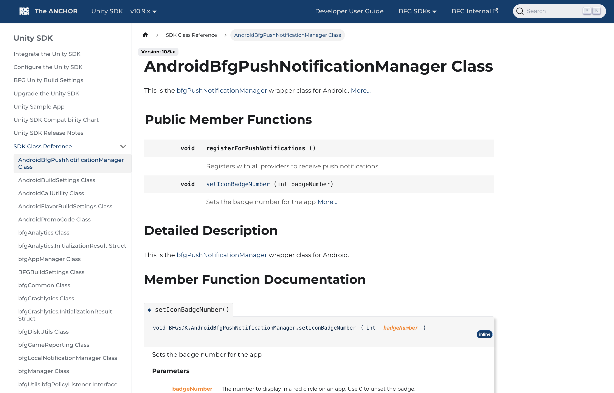

# Developer Documentation

Developer documentation meets the developer where they are, providing language-specific guidance, API references, and code samples to illustrate an API usage. Whether its developing a developer's quick start guide, a detailed API reference, example code snippets, or walk-through tutorials, I've enjoyed working with programmers in many different languages.

# Samples of Developer Documentation

<h2>Big Fish SDKs</h2>

  <figure style="float:right;">
    
      <figcaption style="font-style:italic; text-align:center;">SDK Documentation generated with Doxygen</figcaption>
  </figure>
  <strong>Tools Used:</strong> Doxygen, Docusaurus, GitHub Pages, Markdown, HTML, CSS

The BFG SDKs support game developers by interfacing with Big Fish platform services and surfacing mobile-specific APIs and features. There are three SDKs available - one for Unity, Android and iOS development. This sample showcases the Unity implementation, including an API reference, integration details, and SDK release notes.

Before I joined the SDK team, the documentation was maintained by the SDK developers and hosted on an on-prem web server, separate from the rest of Big Fish's documentation. To streamline and standardize our documentation, I proposed and executed the creation of a centralized, web-hosted portal called The Anchor using Docusaurus and GitHub Pages. This new portal consolidates all our help content, including the SDK reference, into one cohesive site.

To migrate the SDK reference from its own web server to The Anchor, my team developed a custom script to convert the output HTML files into Markdown, which is the expected input format for Docusaurus. We also created additional scripts to address edge cases and ensure proper formatting. To modernize the Doxygen output, we designed a custom CSS stylesheet that aligned with The Anchor's branding, while improving the visual presentation. 

The final step involved using Docusaurus' versioning system to host documentation for previous SDK releases. In Docusaurus, we hosted each SDK on its own instance to create independent sidebar navigation, while maintaining the "skin" of the Anchor site. Each SDK was hosted on its own instance within Docusaurus, providing independent sidebar navigation for each, while preserving the overall look and feel of The Anchor. The complete Unity documentation is now available online through Big Fish's documentation site, <a href="https://docs.bigfishgames.com/unity/integrate-unitysdk">The Anchor</a>. 

<h2>High Fidelity API Reference</h2>

  <figure style="float:right;">
    <a href="api/index.html">
      <figcaption style="font-style:italic; text-align:center;">API Reference generated with JSDoc</figcaption></a>
  </figure>
  <strong>Tools Used:</strong> JavaScript, JSDoc, GitHub Pages, Markdown, HTML, CSS

Prior to joining High Fidelity, the API reference guide was using JSDoc to generate the API documentation; however, the content was extracted from the output files and merged with Markdown template files using a custom JavaScript. The custom script required constant maintenance, and the process of creating files, merging them, then re-creating them was a definitive source of inefficiency. 

After ensuring that I understood the existing architecture, I recommended and proposed a plan to migrate entirely to JSDoc for documentation generation and formatting, and use GitHub Pages to host the generated pages. This removed the dependency on multiple tools working together, and increased the control we had over branding, design, and implementation. 

View the API reference here: <a href="api/index.html">https://ingerjm0.github.io/writing-portfolio/dev/api/index.html</a>.

<h2>JavaScript Quick Start</h2>

  <figure style="float:right;">
    
      <figcaption style="font-style:italic; text-align:center;">JavaScript Quick Start Guide</figcaption>
  </figure>
  <strong>Tools Used:</strong> JavaScript, HTML, CSS

This quick start was developed to help new scripters get acquainted with JavaScript for the first time, specifically when scripting with High Fidelity. It answers the questions: 

<ul>
  <li>What is JavaScript?</li>
  <li>How do I use JavaScript with High Fidelity?</li>
  <li>What are some things I can do with scripting?</li>
  <li>Where can I learn more about scripting?</li>
</ul>

<h3>Sample Chapters</h3>

<ul>
  <li><a href="scripting.html">Getting Started with JavaScript</a></li>
  <li><a href="write-scripts.html">Write Your Own Scripts</a></li>
</ul>

<h2>Getting Started Guide (XML)</h2>

  <figure style="float:right;">
    
      <figcaption style="font-style:italic; text-align:center;">Getting Started Guide for XML</figcaption>
  </figure>
  <strong>Tools Used:</strong> MadCap Flare, Perforce, XML, HTML, CSS

This quick start guides walks IT professionals through integrating <a href="https://www.seagullscientific.com">BarTender software</a> with other applications with BarTender XML Script. Specifically, the BTXML schema provides a way to pass print job data from an external interface directly to BarTender. An XML response message, which contains data that can be used to verify the completion of the job, is automatically created each time a script is received.

Throughout the years, this content has been adopted into many deliverable formats: an introduction to an online help system, a technical white paper, and a BTXML reference guide. 

I'd love to be able to share the entire project with you, but unfortunately, it is not in the public domain. Please contact me for any questions; I'd be happy to discuss in detail my role in this project!

<h2>Tutorial: Create a Portal with High Fidelity</h2>

  <figure style="float:right;">
    <a href="portal.html">
      <figcaption style="font-style:italic; text-align:center;">Tutorial: Create a Portal</figcaption></a>
  </figure>
  <strong>Tools Used:</strong> High Fidelity, JavaScript, JSDoc, Markdown, GitHub Pages

For this project, I developed a tutorial that instructed our users how to achieve advanced functionality with High Fidelity's open source platform using scripting. Specifically, this tutorial walks someone through the creation of an object, then scripts its behavior to transport an avatar to another location in the metaverse. 

The entire goal of this project (and its accompanying tutorials) is to educate users on the immense functionality that the JavaScript API provides. Here, I break down an advanced feature to its simplest parts so that creators with basic scripting knowledge can learn from the samples and develop their own functionality through scripting.

View my developer tutorial on how to create a portal here: <a href="portal.html">https://ingerjm0.github.io/writing-portfolio/dev/portal.html</a>

