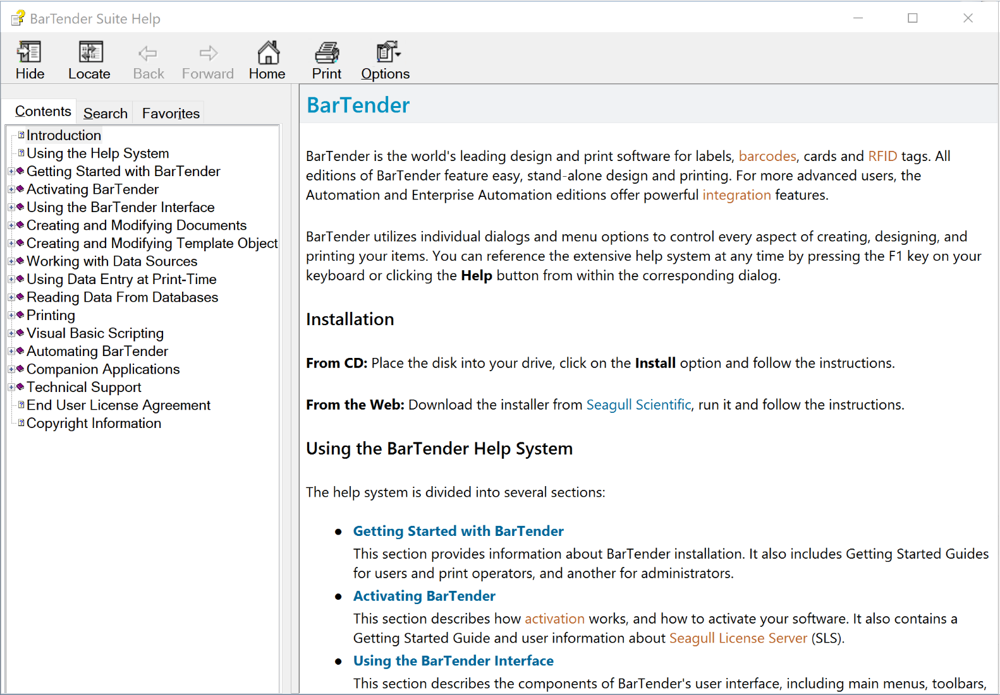
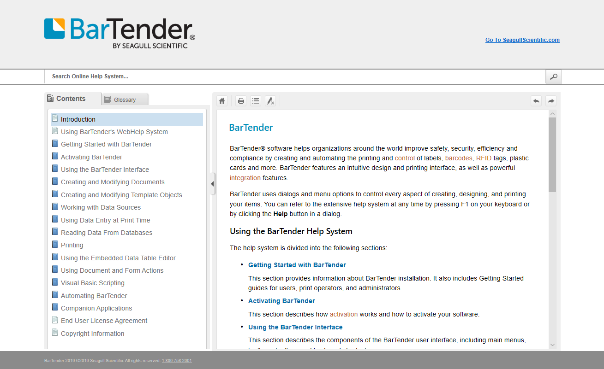

## Online Help System - Sample 2

**Tools Used:** MadCap Flare, Lingo, Capture and Contributor, Perforce, SDL Trados, HTML, CSS, HTML5, Paint.NET

When I started as a Technical Writer at Seagull in 2009, all of the documentation was compiled using HTML Help Workshop. For those technical writers who have been around a while, HTML Help Workshop created CHM files, or compressed help windows that are directly integrated into the software product. It was discontinued in 2003, 6 years prior. 

In an attempt to simplify the compilation process and standardize writing procedures, I migrated the documentation over to MadCap Flare. This required: 

* Setting up a revision control system in Perforce 
* Creating a MadCap Flare project to handle 2000+ content pages
* Defining a process to create CHM files
* Modernizing our deliverables by creating an online help system in addition to the CHM output
* Optimizing the web output for desktop, tablet and mobile viewers
* Working with localization vendors to integrated SDL Trados with MadCap Lingo for translations

