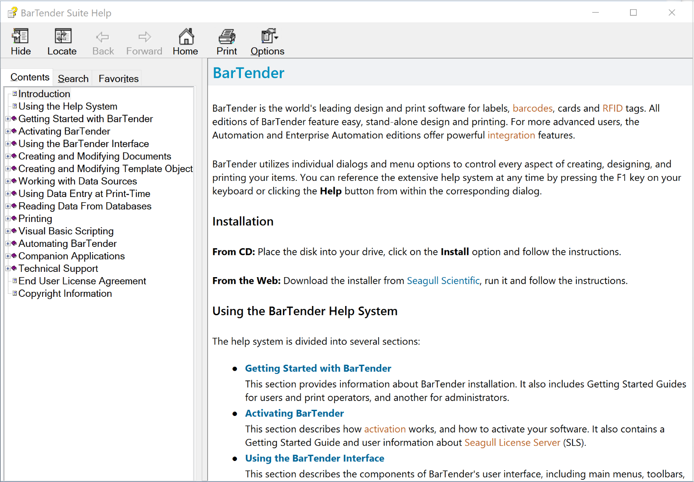

# Online Help Systems

## Sample 1 - High Fidelity Online Docs

**Tools Used:** Sphinx, Read the Docs, Markdown, reStructuredText (RST), CSS, HTML5, Paint.NET

This project called for a cost-effective, but flexible system to create, generate, customize and host an online documentation system for an open source platform. This online help system uses [Sphinx](http://www.sphinx-doc.org) to generate the documentation, and [Read the Docs](https://readthedocs.org) to publish/host it. GitHub is a helpful middleman and stores all of the docs.

I researched the available content management and hosting tools, and selected this one -- it is low cost, easy to use, and creates many high-end features such as localization support and optimized search capability. From there, I customized the native templates using CSS and HTML to match company branding and optimize the help system's structure. I then led my team through the migration of all content from Grav to Sphinx/Read the Docs. 

Following the conversion, I continued to implement continual improvements to the system, including:

* Creation of a new information architecture
* Simplications to stylesheets and templates for future maintenance
* Addition of release notes
* Addition and revision of new content as requested

View the system here: <a href="https://hifi-docs.readthedocs.io/en/latest" target="_blank">https://hifi-docs.readthedocs.io</a>

> NOTE: This copy of the online help system has been forked from High Fidelity's open source code base and is hosted using a free version of Read the Docs, which includes ads. These ads were removed in the final publication of the docs by purchasing a commerical license for Read the Docs.

## Sample 2 - Seagull Scientific Help System

**Tools Used:** MadCap Flare, Lingo, Capture and Contributor, Perforce, SDL Trados, HTML, CSS, HTML5, Paint.NET

When I started as a Technical Writer at Seagull in 2009, all of the documentation was compiled using HTML Help Workshop. For those technical writers who have been around a while, HTML Help Workshop created CHM files, or compressed help windows that are directly integrated into the software product. It was discontinued in 2003, 6 years prior. 

In an attempt to simplify the compilation process and standardize writing procedures, I migrated the documentation over to MadCap Flare. This required: 

* Setting up a revision control system in Perforce 
* Creating a MadCap Flare project to handle 2000+ content pages
* Defining a process to create CHM files
* Modernizing our deliverables by creating an online help system in addition to the CHM output
* Optimizing the web output for desktop, tablet and mobile viewers
* Working with localization vendors to integrated SDL Trados with MadCap Lingo for translations

