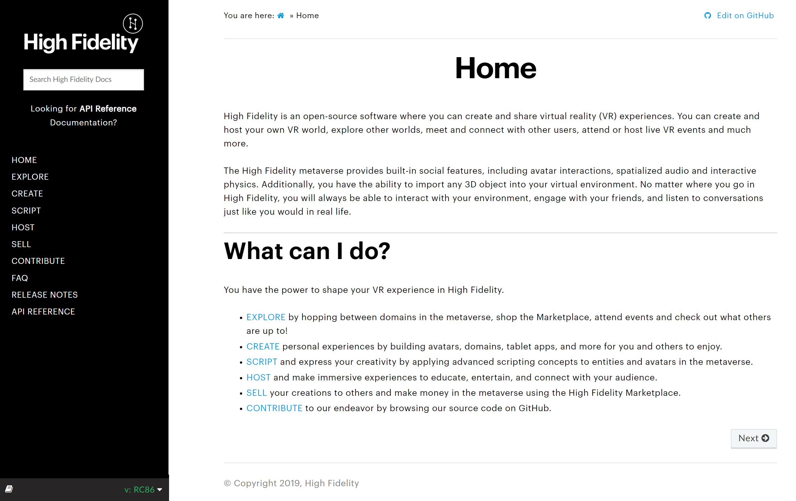
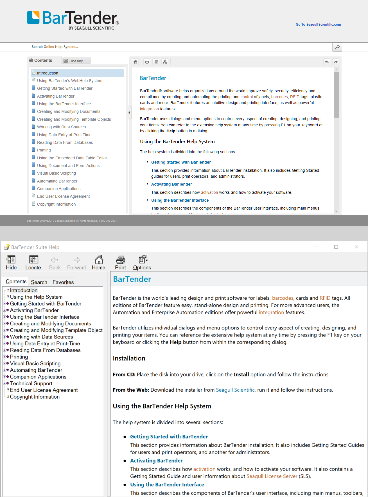

# Online Help Systems

An online help system is more than just pages of text. Its a form of user assistance, designed to walk a user directly to the topic that will best help them. Great online help systems know their audience, simplify the navigation, and stay on top of the most recent technological and design trends.

<h1>Samples of Online Help Systems</h1>

 
<h2>High Fidelity Online Docs</h2>

  <figure style="float:right;">
    <a href="https://hifi-docs.readthedocs.io/en/latest">
      <figcaption style="font-style:italic; text-align:center;">Online System generated with Sphinx</figcaption></a>
  </figure>
  <strong>Tools Used:</strong> Sphinx, Read the Docs, Markdown, reStructuredText (RST), CSS, HTML5, Paint.NET

In this project, I retained content from Markdown files and used them to create a robust documentation system that includes:

<ul>
  <li>Mature, clean and customizable HTML themes to provide a great user experience</li>
  <li>Advanced full-text search functionality</li>
  <li>Content reuse through includes</li>
  <li>Referencing across multiple pages and projects</li>
  <li>Single source publishing (HTML, PDF, ePub and more)</li>
  <li>Version control</li>
</ul>

The High Fidelity documentation system uses <a href="http://www.sphinx-doc.org">Sphinx</a> to generate the documentation, and <a href="https://readthedocs.org">Read the Docs</a> to publish/host it. GitHub is a helpful middleman and stores all of the docs.

High Fidelity is available as an open-source platform, and all content is forked and hosted according to the distribution requirements set out in the <a href="https://www.apache.org/licenses/LICENSE-2.0">Apache License 2.0</a>. 

View the system here: <a href="https://hifi-docs.readthedocs.io/en/latest" target="_blank">https://hifi-docs.readthedocs.io</a>

<h2 style="color:silver;">Seagull Scientific Help System (CHM, HTML5)</h2>

  <figure style="float:right;">
    
      <figcaption style="font-style:italic; text-align:center;">HTML5 and CHM Help Systems generated with MadCap Flare</figcaption>
  </figure>  
  

<strong>Tools Used:</strong> MadCap Flare, Lingo, Capture and Contributor, Perforce, SDL Trados, HTML, CSS, HTML5, Paint.NET

When I started as a Technical Writer at Seagull in 2009, all of the documentation was compiled using HTML Help Workshop. For those technical writers who have been around a while, HTML Help Workshop created CHM files, or compressed help windows that are directly integrated into the software product. It was discontinued in 2003, 6 years prior. 

To simplify the compilation process and standardize writing procedures, I migrated the documentation over to MadCap Flare. This required: 

<ul>
  <li>Setting up a revision control system in Perforce </li
 <li>Creating a MadCap Flare project to handle 2000+ content pages</li>
 <li>Defining a process to create CHM files</li>
 <li>Modernizing our deliverables by creating an online help system in addition to the CHM output</li>
 <li>Optimizing the web output for desktop, tablet and mobile viewers</li>
 <li>Working with localization vendors to integrated SDL Trados with MadCap Lingo for translations</li>
</ul>

I'd love to be able to share the entire project with you, but unfortunately, it is not in the public domain. Please contact me for any questions; I'd be happy to discuss in detail my role in this project!

