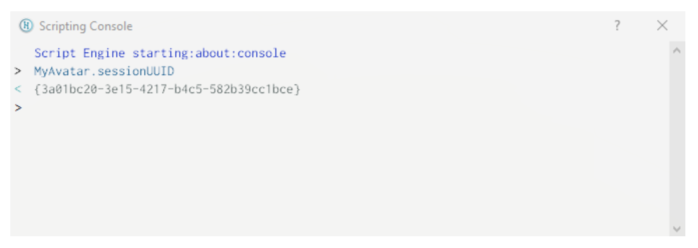
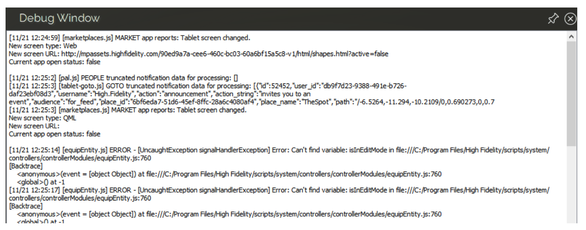

# JavaScript Quick Start - Sample
**NOTE:** All links in this document will return to the knowledge base overview.

[Return to JavaScript Quick Start Overview](overview.html)

---

## Getting Started with JavaScript

JavaScript lets you access High Fidelity functionality and use it to create custom behavior, applications, and actions. In High Fidelity, every time something dynamic occurs in your domain (you avatar moves, an installed app runs, or your avatar responds to entities in a domain), then a script is likely involved. 

Many of the scripts in High Fidelity run behind the scenes, so that you don’t even know they’re running. However, if you want to create some advanced behavior, you may need to write your own scripts to make sure everything works correctly.

In High Fidelity, all scripts run on a JavaScript engine that is provided with Qt. Note that any functionality that runs around web pages (such as cookies, local storages, or databases) does not work with 3D environments such as High Fidelity. For this reason, you cannot use JavaScript frameworks such as Angular, React, Express, jQuery, Vue, etc.

Let's take a look at the types of scripts you can create and use with High Fidelity:

* *Interface scripts* run as long as you have Interface running. With these scripts, you can perform one-time creation tasks or modify the user experience with new menus, overlays, tweaks, plugins, and extensions.
* *Assignment client scripts* coordinate the actions between entities and avatars in your domain. These scripts continue to run even when you shut down Interface.
* *Avatar scripts* run on an avatar and can give it unique effects, such as flowing hair.
* *Client entity scripts* are scripts attached to entities that run locally in response to a user in a domain. With these scripts, you can customize what happens when a user encounters an entity.
* *Server entity scripts* are scripts attached to entities that do not require a user to trigger. These scripts control entities so that their behavior is seen and heard by everyone in the domain.

### Sample Scripts 

High Fidelity comes with a collection of scripts designed to improve your experience as a user and provide tools for developing your own content. We encourage you to look at these scripts as a resource to learn how to code your own. These are the scripts we have available:

* **Android Scripts**: These scripts were built to run on Android devices.
* **Developer Scripts**: These scripts were created for internal use and debugging, but are available as advanced developers may find them useful when creating content. These scripts are not "entry-level" and are not guaranteed to work or be documented.
* **Module Scripts**: These scripts create external tools that simplify scripting in High Fidelity. For example, the AppUI module helps you create a tablet app, while the Request module processes HTTP requests.
* **System Scripts**: These scripts are critical to the stability and usability of High Fidelity. Making changes to these scripts is not recommended, nor is it easy, as you may need admin privileges.
* **Tutorials**: These scripts provide examples of what you can do using scripts in High Fidelity. Examples include: creating butterflies, making your avatar clap, and adding ambient sound to your domain.

### Load and Run a Script 

To run a script:

1. Open the 'Running Scripts' window.
2. For scripts hosted in the cloud, click 'From URL'. Enter the URL of your script file and click 'OK'.
3. For scripts on your local computer, click 'From Disk'. Browse to your script file and click 'Open'.
4. To load a sample script, browse to the script at the bottom of the 'Running Scripts' window.

## Tools for Scripting

Use the following tools to help you test and debug your scripts. 

### Scripting Console

The Scripting Console lets you test and run short script snippets quickly in High Fidelity to see how they work. To open the console, go to the 'Developer' menu, then **Scripting > Console**. 

### Debug Window

The Debug Window shows the output generated by your running scripts. This lets you watch the script(s) in action and make sure that it is running as you intended. If the script fails, the debugger can help you identify what went wrong, and point you to specific lines of code where the error occurred. To open the Debug Window, go to the 'Developer' menu, then **Scripting > Script Log (HMD Friendly)**. 

<a href="write-scripts.html">Continue to 'Write Your Own Scripts'</a>

