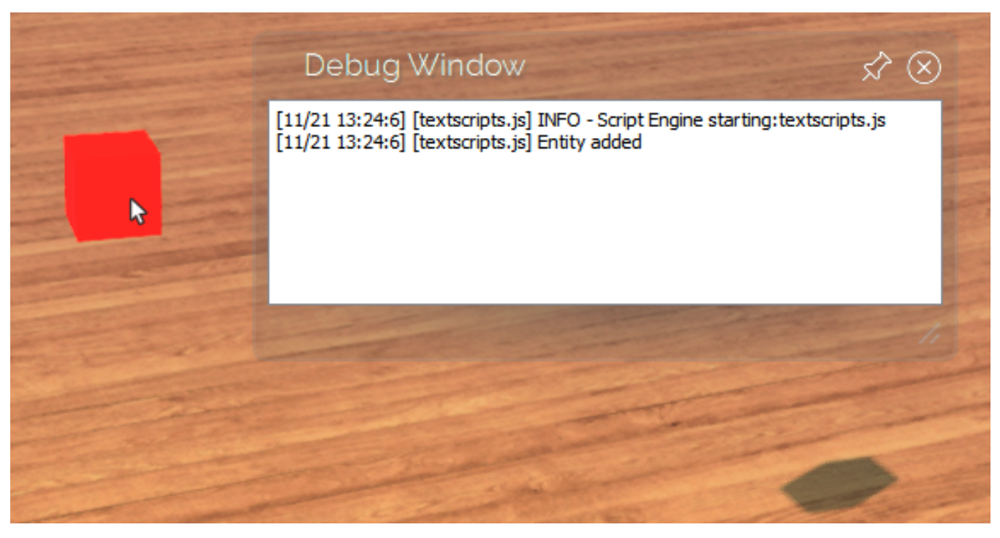
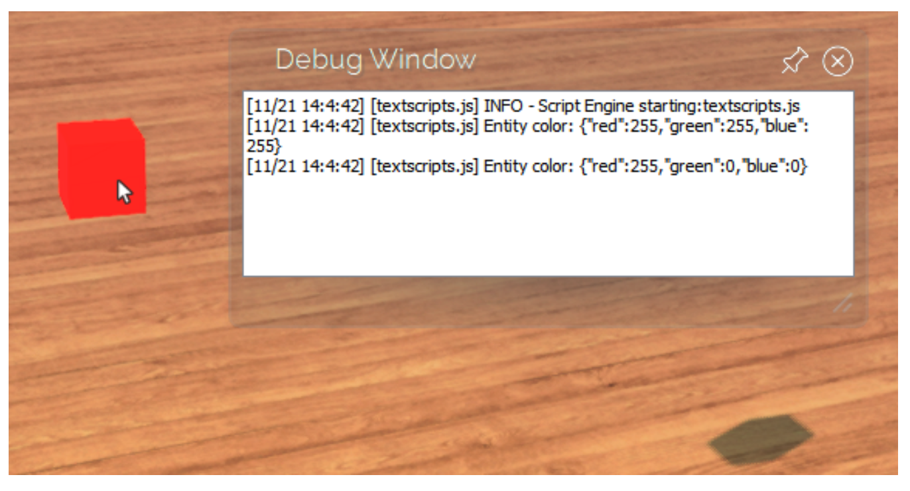

# JavaScript Quick Start - Sample Chapter 2

[Return to Overview of JavaScript Quick Start](overview.html)

---

## Write Your Own Scripts

High Fidelity’s robust JavaScript API provides the tools for you to build great content and user experiences in VR. In this section, you can find simple code samples to do common tasks in High Fidelity. 

### Print Text to the Debug Window

This sample shows you how to print text to the debug window. 

    print("Hello, World");

When you load and run the script, it will print the words "Hello, World" to the Debug Window.

### Create an Entity

Instead of creating an entity with the GUI, you can create one with an interface script:

    // Get your position in the domain, so that the cube is spawned in front of you
    var position = Vec3.sum(MyAvatar.position, Quat.getFront(MyAvatar.orientation));
    var properties = {
        type: "Box",
        name: "ScriptBox",
        position: position,
        color: { red: 255, green: 0, blue: 0 }
    };
    var entityID = Entities.addEntity(properties);
    print("Entity added");

When you load and run this script, it will locate your avatar in the domain, create a new entity based on the customized properties that you set, then print a line to the Debug Window. In this case, the entity will be a red box.

### Edit an Entity

To change an entity's properties, you can use the `Entities.editEntity` method in an interface script:

    var entityID = Entities.addEntity({
        type: "Box",
        position: Vec3.sum(MyAvatar.position, Quat.getFront(MyAvatar.orientation)),
    });

    var properties = Entities.getEntityProperties(entityID, ["color"]);
    print("Entity color: " + JSON.stringify(properties.color));

    Entities.editEntity(entityID, {
        color: { red: 255, green: 0, blue: 0 }
    });
    properties = Entities.getEntityProperties(entityID, ["color"]);
    print("Entity color: " + JSON.stringify(properties.color));

When you load and run this script, it will locate your avatar in the domain, create a new entity based on the customized properties that you set, then print the color of that entity to the Debug Window. Then, the script changes the color of the entity to red, and prints the new color in the ‘Debug Window’.

