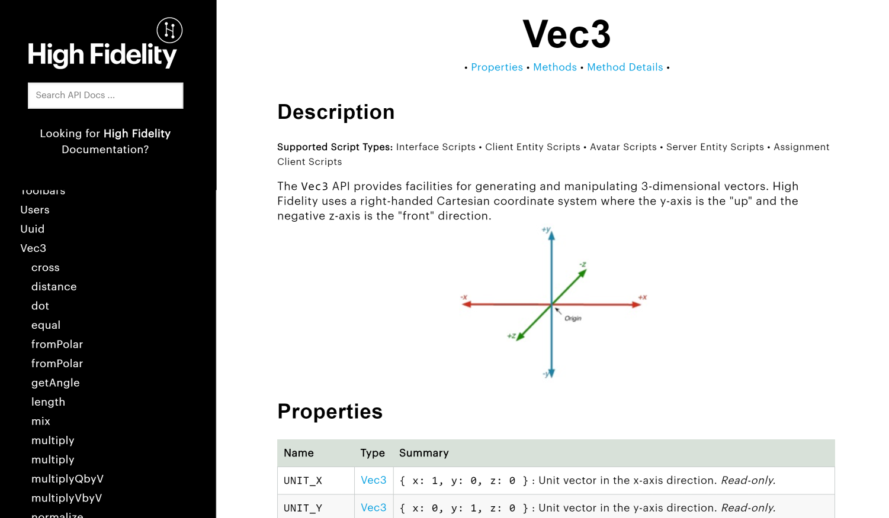

## JavaScript API Reference

**Tools Used:** JavaScript, JSDoc, GitHub Pages, Markdown, HTML, CSS

Prior to joining High Fidelity, the API reference guide was using JSDoc to generate the API documentation; however, the content was extracted from the output files and merged with Markdown template files uisng a custom JavaScript. The custom script required constant maintenance, and the process of creating files, merging them, then re-creating them was a definitive source of inefficiency. 

After ensuring that I understood the existing architecture, I recommended and proposed a plan to migrate entirely to JSDoc for documentation generation and formatting, and use GitHub Pages to host the generated pages. This removed the dependency on multiple tools working together, and increased the control we had over branding, design, and implementation. 

The High Fidelity JavaScript API lets content creators and developers create new experiences and transform virtual worlds within the High Fidelity metaverse. 

[View the API reference here](api/index.html). 

