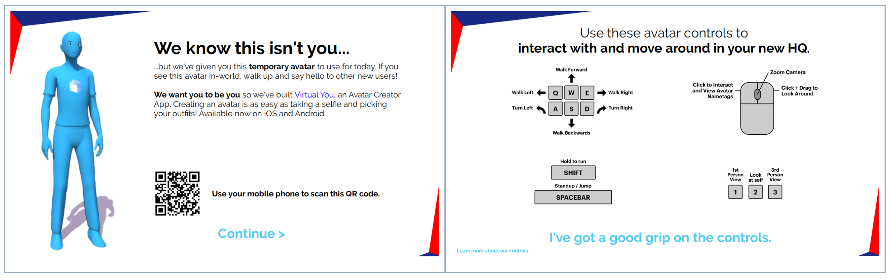
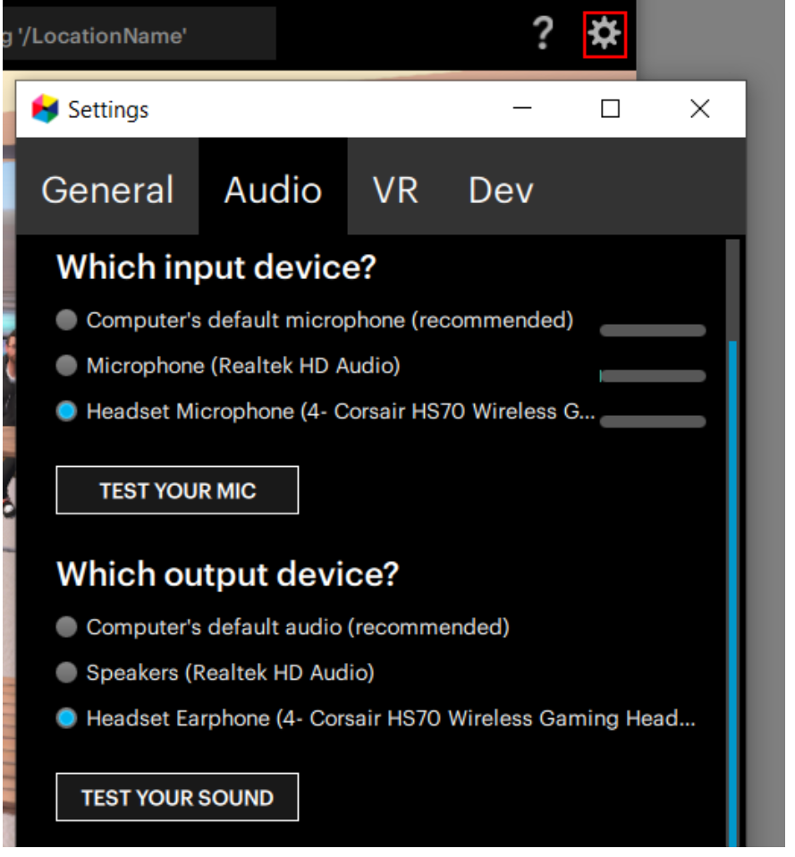

# Knowledge Base Article - Sample 1
**NOTE:** All links in this document will return to the knowledge base overview.

[Return to Knowledge Bases](overview.html)

---

## Your First Day in Your Virtual Office

Welcome to your virtual workplace, a unique digital solution designed to improve collaboration, morale, and connection among your team!

If it's your first time in your virtual workplace, then we know it might be a little daunting -- you need to learn all of the ropes, get your computer set up, and adjust to a new way of working together. To help you get off on the right foot, we've gathered a few tips to help you adapt quickly and thrive in this new environment.

1. **Come in with an open mind...it can make all the difference.** It will help you see the exciting possibilities, quickly adapt to your new workplace, and stay calm/troubleshoot if things go awry.
2. **Have all of your hardware ready and easily accessible.** This includes not only your computer, but also your headset, keyboard, mouse, and any other peripherals that will make you comfortable working all day at your computer. Also consider setting up your physical workspace ahead of time - the more comfortable you are in your physical location, the more comfortable you will be in the virtual world.
3. **Walk through the Set Up Wizard.** This wizard, written specifically for novice and first-time users, walks you through getting an avatar and learning to move around your environment.

4. **Set up your audio devices.** Most of the time, your audio will work "out of the box" when you enter your virtual workplace. However, if you cannot hear anything (or others can't hear you), then you will need to change your audio devices and/or configure your settings. Try the following:

	1. Mute yourself (this ensures that you're not accidentally broadcasting sound to others in your virtual office). 
	2. Make sure High Fidelity is using the right audio devices (you may be using your computer's microphone/speakers, a headset, or an external microphone). 
	
	**NOTE:** Bluetooth headsets (like AirPods) require advanced setup. If this is your first time, we recommend using a different audio device until you get more familiar with the settings.
5. **Test your microphone and headphones/speakers.**

	1. Click ‘Test Your Mic’ to test your input device. Speak into your mic, and the sound will be played right back at you through the selected output device. 
	2. Click ‘Test Your Sound’ to test your output device. 
If the sound from your tests isn't good, you likely need to fine tune your audio settings on your computer or on your device. For more information, see How do I adjust my audio and microphone settings?
6. **Explore!** You know the saying "Practice makes perfect"? Now is the time to start exploring and become more comfortable with your new workplace. 

You may also be interested in reading:

* [Welcome to High Fidelity's Virtual Office!](../overview.html)
* [Best Practices for Working in a Virtual Office](../overview.html)
* [I cannot connect to my virtual workplace](../overview.html)
