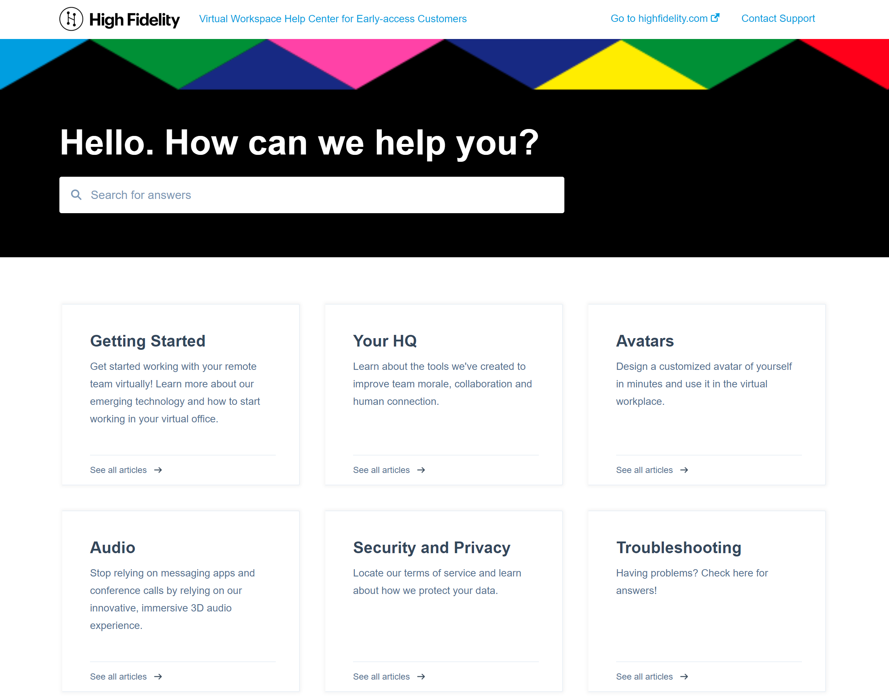

## Online Knowledge Base

**Tools Used:** HubSpot, Paint.NET, Markdown, HTML

This project involved creating an online searchable knowledge base for a new, early-access beta software application. I identified the top user stories and developed categories to match what users would want to know. I then conceptualized and wrote all of the content for the knowledge base. Working closely with the Marketing team, I then developed a design that was clean and consistent with the company's branding strategy. 

**Sample Articles**

* [Your First Day in Your Virtual Office](ftue.html)

All images were edited using the open source software, Paint.NET. Pages were written and formatted in Markdown, with minor edits made using HTML. 

