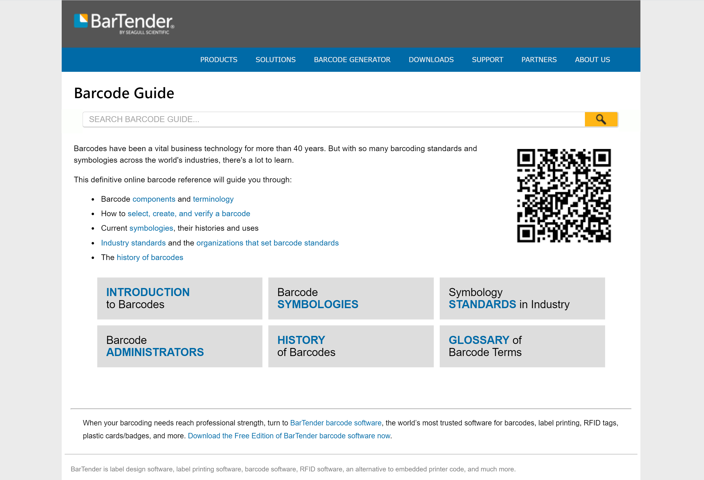

# Other Professional Works

These samples represent other written works that I've produced in my professional career, ranging from reference guides to project management plans and software specifications. 

<h2>Barcode Guide</h2>

  <figure style="float:right;">
    
      <figcaption style="font-style:italic; text-align:center;">Barcode Reference generated with MadCap Flare</figcaption>
  </figure>
  <strong>Tools Used:</strong> MadCap Flare, HTML, CSS, BarTender Suite

Barcodes have been a vital business technology for more than 40 years. But with so many barcoding standards and symbologies across the world's industries, there's a lot to learn. Did you know that there are over 100 different barcodes to choose from? Or that some barcodes require very specific information to be encoded in them? Some barcodes even have advanced technology built in, so that if part of the code is damaged, it will still be readable. All of this is to ensure safety, security, efficiency and compliance as barcodes are used to track products in many different industries.

I learned all of this and more at Seagull Scientific, which develops BarTender® barcode labeling and enterprise printing software. When I first started working here, all of my barcoding knowledge was passed down from fellow peers and co-workers. While the internet contained some information, none of it was in the same spot. So I (as an employee at Seagull) developed a barcode guide, which remains one of the most comprehensive references for barcode information. 

  

No matter how you obtain your barcodes, I highly recommend using this guide for help in choosing a barcode type or ensuring that your barcodes are encoded correctly. But may I suggest you use Seagull's <a href="https://www.seagullscientific.com/barcode-generator">free barcode generator</a> or purchase their award-winning BarTender design and printing solution? 

  

<strong><a href="https://barcodeguide.seagullscientific.com">View Seagull's free barcode guide here!</a></strong>

<h2>Project Plans</h2>

  <figure style="float:right; margin-top:-35px;">
    
  </figure>
  
Every project plan tells a story about the project's background, goals, teams, and deliverables. Just like a creative narrative, a project plan fills in details and a timeline in chapters (or phases) and ensures a "happily ever after" for the stakeholders. It serves as a roadmap that shows a project's phases, key activities, dependencies between tasks, and project milestones.

NOTE: These are all examples based off of project plans that I've created, but do not reflect any proprietary work done for any employer. All names, projects, deadlines, etc. are made up for the purpose of this portfolio.

Click to view a sample project plan below:

<ul>
  <li><a href="toc.html">Project Plan: Reorganization of Help System</a></li>
  <li><a href="kb.html">Project Plan: Knowledge Base Implementation</a></li>
</ul>

<h2>Documentation Tools</h2>

  <figure style="float:right;">
    
  </figure>
  
Throughout my career, I've implemented many different help authoring tools, documentation systems, and content management systems for technical writing teams, successfully balancing a tool's functionality and feature set with the budget, size, and needs of the company. I am now an expert in content systems new and old, including MadCap Flare, Paligo, Sphinx, RoboHelp, HTML Help Workshop, GitBook, and more. 

When a new system is deployed, I believe that everyone, not only the technical writers, should have access to the implementation and capabilities of the tool. Therefore, I typically write a detailed article published on the company's intranet site. 

Click to view sample implementations of tools I've deployed in my career below:

<ul>
  <li><a href="sphinx.html">Sphinx and Read the Docs</a></li>
  <li><a href="jsdoc.html">JSDoc and GitHub Pages</a></li>
</ul>

